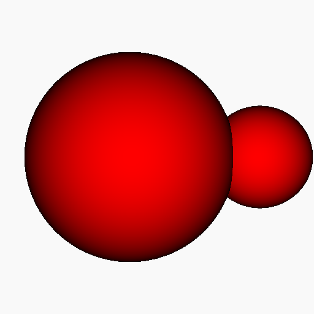

# Render Signed Distance Functions using Sphere Tracing
This code shows an implementation of sphere tracing to render the implicit surface of signed distance functions. 

A signed distance function returns the closest distance *d* from a given point *p* to the surface. It partitions the space as follows:
* d = 0: Point is on the surface
* d > 0: Point is outside the object
* d < 0: Point is inside the object

Sphere tracing uses Lipschitz continuity to safely adapt step size in such way that the surface is not penetrated. The step size is divided by the global Lipschitz bound *lambda*. 

The normal vectors are estimated using forward differences.

Example:

# References

Hart J. C.: Sphere Tracing: A Geometric Method for the Antialiased Ray Tracing of Implicit Surfaces. The Visual Computer 12, 10(1996), 527–545